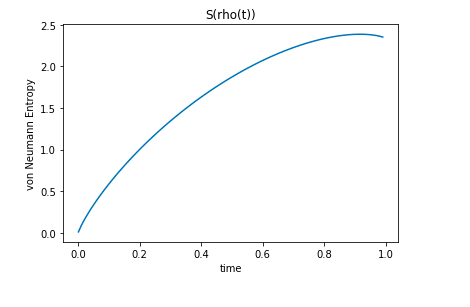

# Entropy

This repository includes a notebook covering von Neumann entropy of quantum states using density operators. 

## What is...Entropy?

Entropy can be thought of in two ways. It can be thought of as the uncertainty we have about the state of a given system, or as the amount of information we gain after measuring the system. In quantum physics and quantum computing von Neumann entropy is one of the main forms of entropy used to study quantum systems. In this tutorial we give a brief introduction to classical Shannon entropy, defined by the mathematician Claude Shannon while working at Bell Labs. We then move on to von Neumann entropy, the quantum version of Shannon entropy. We give several examples of how entropy might change over time when a system evolves from one quantum state to another, such as in the following graph where the system evolves from a **pure state** into a **mixed state**. 

Notice how the maximum is actually at an intermediate point in time, just before the final mixed state is achieved. Generally speaking, entropy has a tendency to only increase over time. However, in (effectively) "*closed*" quantum systems where we have a lot of control, we can bring the entropy to a lower level and modify it in more or less arbitrary ways. 

## [The Interactive Jupyter Notebook](https://mybinder.org/v2/gh/The-Singularity-Research/entropy/dc07a29c4afef404d02c9ff12b2d072d16a41154?filepath=entropy.ipynb)

